# Gyroflow to CSV

"Gyroflow to CSV" is a Python script that converts your [Gyroflow](https://gyroflow.xyz) stabilization to a CSV file.

Make sure to choose "including processed gyro data" when exporting from Gyroflow. As default it saves out the rotations as Euler rotation (ZYX). It also saves out the data in your footages' native frame rate.

Requirements:  
- Resolve (free) or Resolve Studio or Fusion Studio
- Python 3.6+ is required to use this script.

# DragDrop Support

The Gyroflow Fusion toolset supports drag and drop handling of .gyroflow files. This works by dragging the file from an Explorer/Finder/Nautilus desktop folder browsing location and dropping the file into the Fusion nodes view area.

In this situation, the Gyro Fusion script is automatically launched and the "Gyroflow Filename" textfield is pre-filled in advance in the GUI.

# Using the Script

To run the script, open the Fusion Studio based "Script > Gyroflow Fusion > Gyroflow to CSV" Menu item.

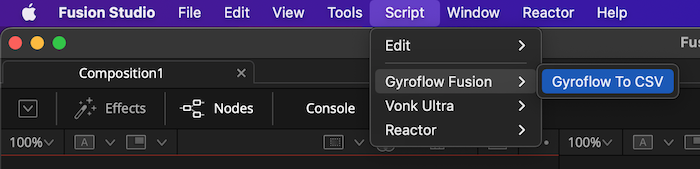

## Splash Screen

A splash screen is shown that provides usage information about the required Gyroflow export settings. 

"The script converts your Gyroflow stabilization to a CSV file. Make sure to choose "including processed gyro data" when exporting from Gyroflow. As default it saves out the rotations as Euler rotation (ZYX). It also saves out the data in your footages' native frame rate."

Click the "Continue" button to proceed.

Note: If you want to go to the Gyroflow website you can click on the logo image at the top of the dialog.

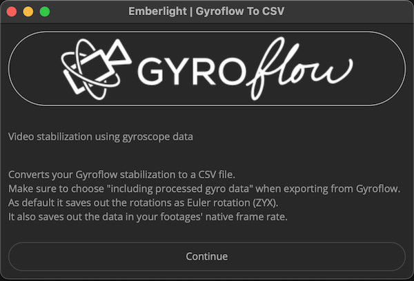

## File Dialog

This dialog is used to define the parameters used when the Gyroflow document is exported to a CSV file. In the "Gyroflow Filename" field select a file with the ".gyroflow" file extension.

Click the "Go" button to proceed.

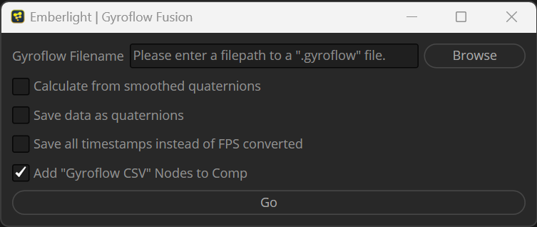

* * *

If you enabled the '[x] Add "Gyroflow CSV" Nodes to Comp' checkbox in the dialog, a Vonk node graph is inserted into your Fusion composite that has the path to the Gyroflow generated CSV file pre-entered into the "vTextFromFile" node's "Input" textfield.

The nodes named "xGyro1", "yGyro1", and "zGyro1" provide the Number data-type based outputs for the Rotate X/Y/Z channels of IMU (inertial) stabilization data from Gyroflow.

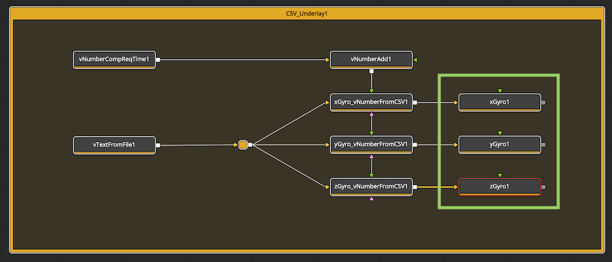

* * *

If you have a large Gyroflow file that takes a while to process, you can watch the progress status in the Console window. Clicking the Console button on the top left of the Fusion interface, or pressing the "Shift + 0" hotkey is a quick way to open the Console window.

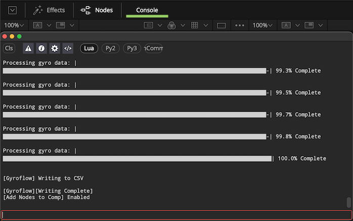

## Macro

A "Gyroflow CSV" macro is available in the "Select Tool" dialog. This macro makes it quick and painless to quickly add the supporting Vonk nodes to the node-graph.

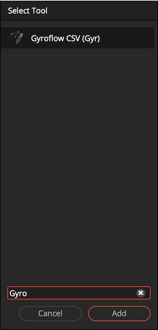

The nodes named "xGyro1", "yGyro1", and "zGyro1" provide the Number data-type based outputs for the Rotate X/Y/Z channels of IMU (inertial) stabilization data from Gyroflow.

# Example Fusion Comp

A Gyroflow example compositing project is provided that includes a short video clip, a .gyroflow file, and a CSV export. This project shows an applied use of the "Gyroflow to CSV" script and [Vonk](https://docs.google.com/document/d/1U9WfdHlE1AZHdU6_ZQCB1I2nSa5I7TyHG2vKMi2I7v8/edit?usp=sharing) data nodes inside of Fusion. 

In order to use this example comp you need to have Vonk installed (from the Reactor Package Manager) to read a Gyroflow CSV file and drive a 3D camera with it. 

Open the example project if you want to see how it's done:

`Reactor:/Deploy/Comp/Gyroflow Fusion/Gyroflow.comp`

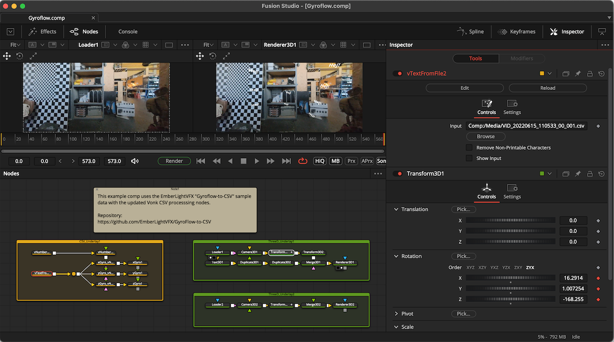

# Gyroflow Node Connections

You can connect these nodes to your Fusion 3D workspace based Camera3D or Transform3D node's Rotation channels.

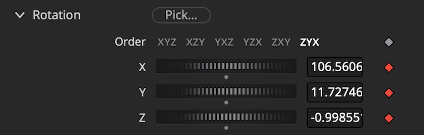

Right-clicking on either of the X/Y/Z channel keyframe "diamond shapes" in the Inspector view provides access to the "Connect To" contextual menu entry.

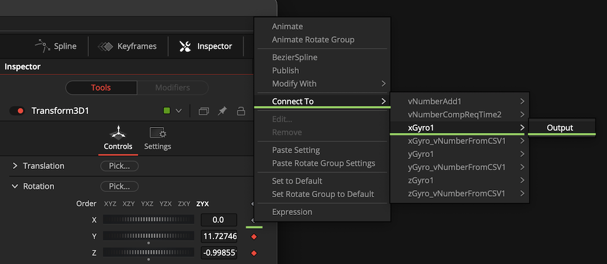

The mapping of Gyroflow channels is:

    xGyro1.Output -> Transform3DOp.Rotate.X
    yGyro1.Output -> Transform3DOp.Rotate.Y
    zGyro1.Output -> Transform3DOp.Rotate.Z

## Timeline Render Start Frame

The "vNumberAdd" node is used to shift the starting frame number when accessing the CSV (comma separated value) text file's "Index" based line number. By default the offset of adding 1 to the current timeline frame number is entered so things work out of the box with a timeline that has frame 0 as the "Render Start" frame value. 

You can easily modify the vNumberAdd node's "Term 2" setting to line up with your VFX workflow needs such as a shot with a frame 1, frame 1000, or frame 1001 "Render Start" frame.

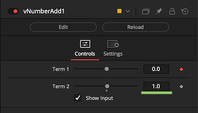

# IMU Motion Corrections

If you need to adjust the direction axis for the IMU corrections, there are two preset values stored in the "Versions" controls for the "xGyro1", "yGyro1", and "zGyro1" nodes.

This applies a "1" or "-1" multiplication operation to the rotation channel data using a Vonk "vNumberMultiply" node's built-in "Factor2" control.

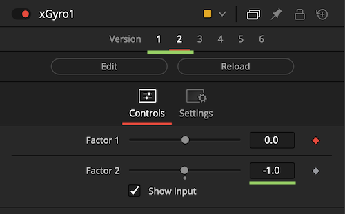

# 360VR Rotation Correction

If your footage was filmed on a 360VR spherical camera that records internal IMU data, it is posible to apply the Gyroflow corrections to a Resolve/Fusion built-in "PanoMap" node instead of using a Camera3D or Transform node.

In this case the mapping of Gyroflow channels is:

    xGyro1.Output -> Rotate.X
    yGyro1.Output -> Rotate.Y
    zGyro1.Output -> Rotate.Z

## Monoscopic 360VR

You would connect your source 360VR footage to a Loader/MediaIn node. Then connect the image output to the PanoMap node:

    Loader -> PanoMap

or

    MediaIn -> PanoMap

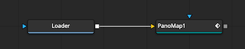

## Stereoscopic3D 360VR

If you are working with Side-by-Side or Over/Under formatted stereo3D footage, you would need to split the left and right eye views apart with Fusion's built-in "Splitter" node.

The PanoMap node is used to apply the view rotation corrections. When adding PanoMap nodes to the comp, the use of the "Copy" and "Paste Instance" commands can be a timesaver as it will keep the left and right eye view node attributes synced up in the Inspector tab.

Finally, the Fusion built-in Combiner node is used to merge the left and right eye views back together again into a single stereoscopic 3D image.

The node connections are:

    Loader/MediaIn -> Splitter

    Splitter.Image1 (Left) -> PanoMap (Left)
    Splitter.Image2 (Right) -> PanoMap (Right)

    PanoMap (Left) -> Combiner.Image1
    PanoMap (Right) -> Combiner.Image2

    Combiner -> Saver/MediaOut

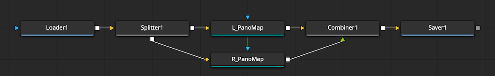

## 360VR Overcapture / Reframing

You could also use Gyroflow X/Y/Z view rotation data to help drive the KartaVR Reframe360 node's output. The Gyroflow data would be connected to the kvrReframe360Ultra node's View Transforms > "Pitch", "Yaw", "Roll" attributes.

This allows the IMU data to be used for the primary view leveling (or motion dampening) effect. This would be followed by a Vonk vNumberMultiply / vNumberAdd node approach to blend in artist controlled keyframable view offset adjustments that are animated across the timeline frame range.

Averaging / motion dampening can be applied using Vonk based temporal effects on Number datatypes. This makes it possible to read frame values ahead/behind the current playhead/timeline frame number (vNumberCompReqTime).
